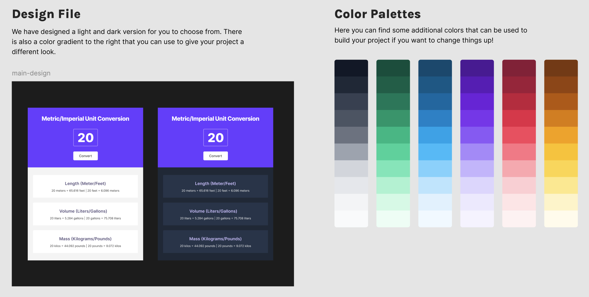
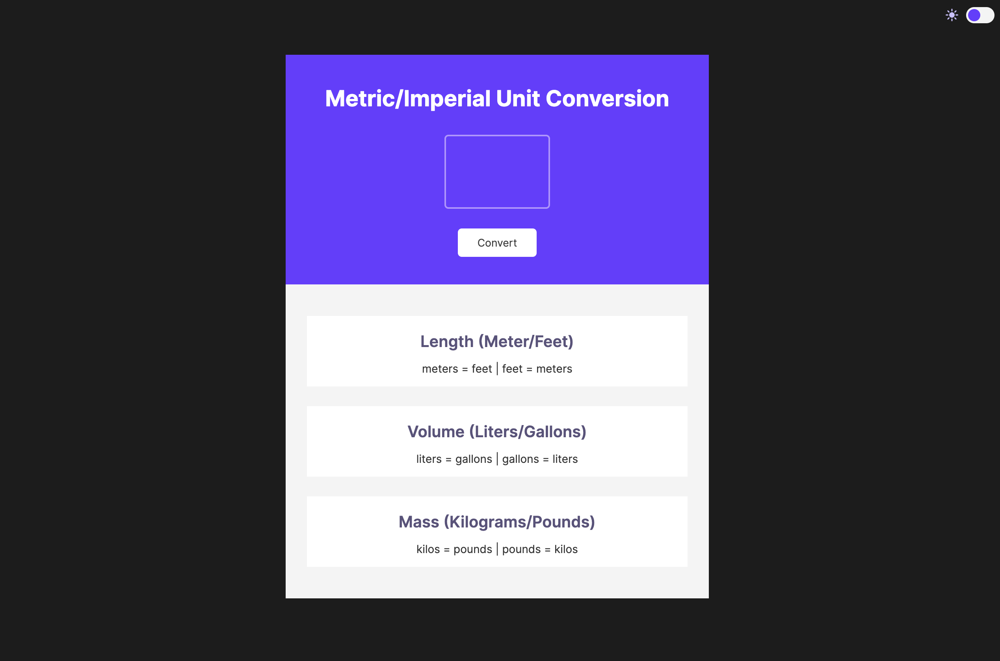
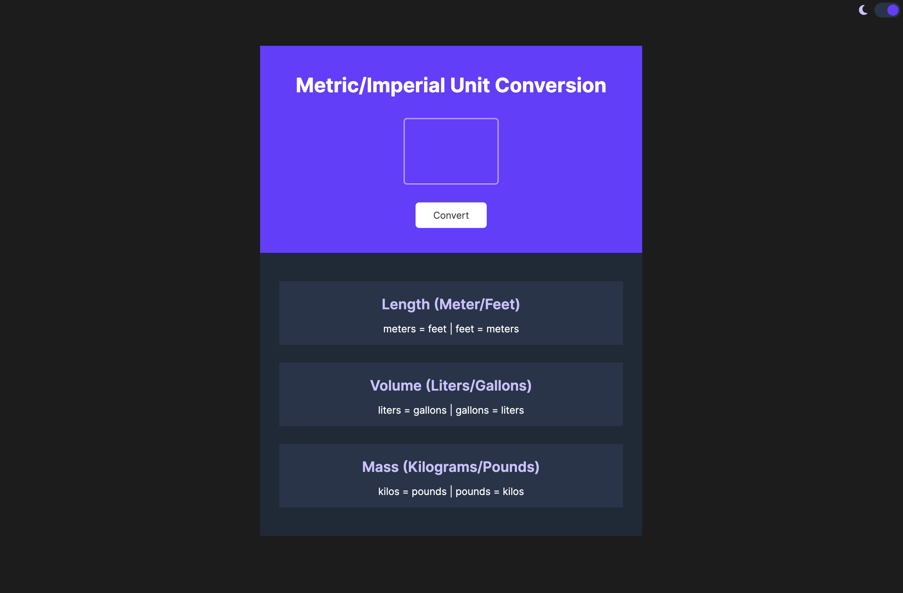
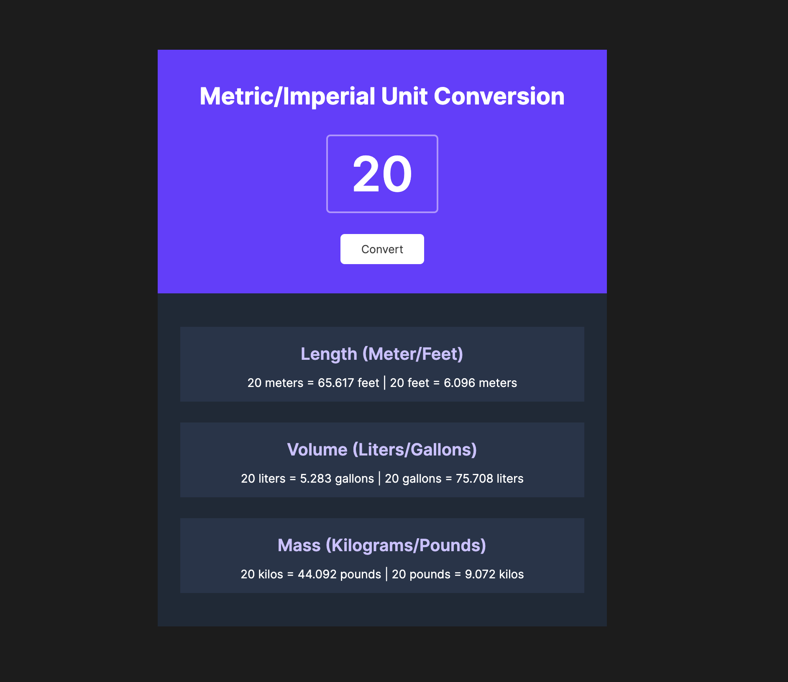

# Unit Converter

This Unit Converter project is part of a Scrimba course. The code was built from scratch, following a provided style guide in Figma for visual reference. The JavaScript logic is original and implemented to perform various unit conversions.

## Table of Contents
- [Features](#features)
- [Design and Style](#design-and-style)
- [Usage](#usage)
- [Credits](#credits)
- [License](#license)
- [Questions](#questions)

## Features
- **Dark Mode Toggle**: Users can switch between light and dark modes using a toggle switch.
- **Length Conversion**: Convert between meters and feet.
- **Volume Conversion**: Convert between liters and gallons.
- **Mass Conversion**: Convert between kilograms and pounds.
- **Responsive Design**: The interface is responsive and works well on various screen sizes.

## Design and Style
The design was guided by a Figma style provided as part of the course. The layout is clean and user-friendly, with a focus on usability and aesthetics. Key elements include:
- A toggle switch for dark mode.
- An input field for entering the value to be converted.
- A convert button to perform the conversions.
- Result sections for displaying the conversion outcomes in different units.

Fonts used: [Inter](https://fonts.google.com/specimen/Inter).

Icons used: [Font Awesome](https://fontawesome.com/) for the toggle switch icons.

## Usage
You can use the unit converter at the following link: [Unit Converter](https://adriannaderkacz.github.io/unit-conventer/).

1. **Enter a Value**: Input a numerical value into the provided input field.
2. **Convert**: Click the "Convert" button to see the converted values in different units.
3. **Toggle Dark Mode**: Use the switch at the top of the page to toggle between light and dark modes.

## Credits
**Design**: Scrimba's Figma design as a part of [Scrimba Frontend Developer Path](https://scrimba.com/learn/frontend)'s project.

**Project Idea**: [Scrimba Frontend Developer Path](https://scrimba.com/learn/frontend).

## License
MIT License

Copyright (c) [2024] [Adrianna Derkacz]

Permission is hereby granted, free of charge, to any person obtaining a copy of this software and associated documentation files (the "Software"), to deal in the Software without restriction, including without limitation the rights to use, copy, modify, merge, publish, distribute, sublicense, and/or sell copies of the Software, and to permit persons to whom the Software is furnished to do so, subject to the following conditions:

The above copyright notice and this permission notice shall be included in all copies or substantial portions of the Software.

THE SOFTWARE IS PROVIDED "AS IS", WITHOUT WARRANTY OF ANY KIND, EXPRESS OR IMPLIED, INCLUDING BUT NOT LIMITED TO THE WARRANTIES OF MERCHANTABILITY, FITNESS FOR A PARTICULAR PURPOSE AND NONINFRINGEMENT. IN NO EVENT SHALL THE AUTHORS OR COPYRIGHT HOLDERS BE LIABLE FOR ANY CLAIM, DAMAGES OR OTHER LIABILITY, WHETHER IN AN ACTION OF CONTRACT, TORT OR OTHERWISE, ARISING FROM, OUT OF OR IN CONNECTION WITH THE SOFTWARE OR THE USE OR OTHER DEALINGS IN THE SOFTWARE.

## Questions
For questions, please contact me at a.derkacz@gmail.com.
GitHub: [adriannaderkacz](https://github.com/adriannaderkacz).